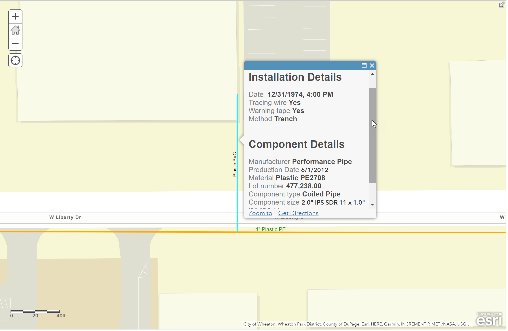

# Return manufacturer from barcode

This example shows how to extract the component manufacturer for a given gas distribution components encoded using the [ASTM F2897 standard](https://www.astm.org/Standards/F2897.htm). This specification defines requirements for the data used in the tracking and traceability base-62 encoding system and the format of the resultant code to characterize various components used in fuel gas piping systems.

## Use cases

In this example we are highlighting how to efficiently display manufacturer information for a natural gas component from a barcode captured in the field.  The component manufacturer code is extracted from the barcode string and displays the full manufacturer name.  

## Workflow

Copy and paste the expression found in the expression template below to the Arcade editor in ArcGIS Online, the relevant location in ArcGIS Pro, or the relevant location in a custom app.

To configure the script to your layer, you must replace the BARCODE variable assignment with the field containing the barcode string from the gas component.  

## Expression Template

```js

var BARCODE = $feature.BARCODE
var manufacturer = Mid(BARCODE, 0, 2)

var d = Dictionary(
        "35", "Industrial Pipe Fittings", 
        "73", "Plasson", 
        "AD", "A-D Technologies",
        "AY", "A.Y. McMcDonald Mfg Co",
        "CH", "Charter Plastics Inc.", 
        "CI", "Continential Industries",
        "CP", "Georg Fischer Central Plastics LLC",
        "DR", "Dresser Pipeline Solutions", 
        "EL", "Elster Perfection", 
        "EN", "Endot Industries Inc",
        "FR", "IPEX inc",
        "GB", "Gas Breaker Inc", 
        "IN", "Innoge", 
        "IU", "IPEX USA LLC",
        "JM", "J-M Manufacturing Co, Inc dba JM Eagle",
        "KT", "Kerotest Manufacturing Corp", 
        "MT", "M.T. Deason Co, Inc", 
        "NG", "Nupi Americas",
        "PE", "Performance Pipe",
        "PP", "DuraLine", 
        "PV", "PolyValve LLC", 
        "RW", "R.W. Lyall", 
        "SB", "Smith-Blair Inc",
        "UI", "Uponor Infra Limited",
        "WL", "WL Plastics")

if (hasKey(d, manufacturer)) {
    return d[manufacturer]    
} else {
    return "Unknown"
}
```

## Example output

See [this web map](https://www.arcgis.com/home/webmap/viewer.html?webmap=e45ac63435f247fa895347ef77894d03&extent=-88.1198,41.8638,-88.1183,41.8646) for examples of how to use this expression in ArcGIS Online.

[]