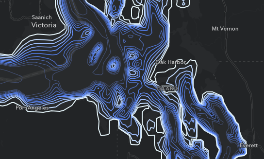

# Unit Conversion

This expression converts one unit of measurement to another. For example, if a layer contains a measurement field in meters, we can use Arcade expressions to convert the value to feet.

## Use cases

Converting units is useful when you have one numeric field that you'd like to represent with another unit of measurement. This is common in the visualization profile as well as the popup and labels profile. This could be used to visualize the depth of the ocean at different contours in meters or in feet. 

## Workflow

Copy and paste the expression found in the expression template below to the Arcade editor in ArcGIS Online, the relevant location in ArcGIS Pro, or the relevant location in a custom app.

To configure the script to your layer, fill in the field name with the measurement field that you would like to convert and set the conversion factor in your expression.

For example, in a layer representing the depth in meters of ocean contours, you would replace this:

```js
var fieldToConvert = $feature.FIELD_NAME;
var factor = 1;  
fieldToConvert * factor;
```

With something like the following:

```js
var fieldToConvert = $feature.DepthInMeters;
var factor = 3.28;  // e.g. use 3.28 to convert from meters to feet
fieldToConvert * factor;
```

## Expression Template
The expression you implement depends on the type of conversion that you would like to perform. [Google conversion](https://goo.gl/R61roL) is a great tool to determine the conversion factor. The example below multiplies meters by 3.28 to obtain the measurement in feet. 

```js
// Common conversion factors
//
// meters to feet = 3.28
// feet to meters = 0.3048
// acres to square meters = 4046.86
// pounds to kilograms = 0.453
// currency, weight, height, volume, etc.
// Google Conversion: https://goo.gl/R61roL 
// ... 

// Replace FIELD_NAME with the measurement field name here
var fieldToConvert = $feature.FIELD_NAME;

// Replace 1 with the conversion factor here
var factor = 1;  // e.g. use 3.28 to convert from meters to feet
fieldToConvert * factor;
```

## Example output

See [this webmap](https://urbanobservatory.maps.arcgis.com/home/webmap/viewer.html?webmap=6211aae5a03148c4b646376e21afef76) for examples of how to use this expression for both visualization and popups in ArcGIS Online. 


