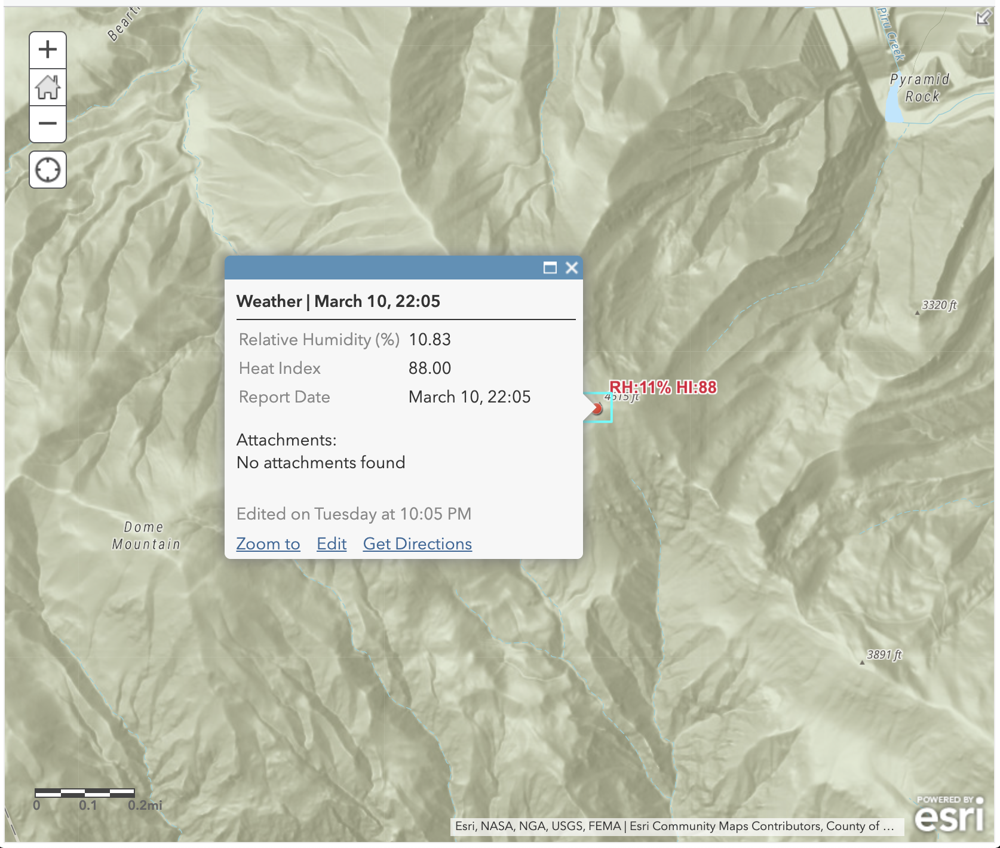

# Calculate relative humidity

This expression calculate the heat index.

## Use cases

Another factor in firefighter safety is the heat index. A high heat index is an indication of a heightened risk of heatstroke or heat exhaustion.  

## Workflow

Copy and paste the expression found in the expression template below to the Arcade editor in ArcGIS Online, the relevant location in ArcGIS Pro, or the relevant location in a custom app.

To configure the script to your layer, edit the first two lines to use the fields representing the desired wall height and type.

```js
var dryBulbTemperature = $feature["drybulb_temperature"];
var wetBulbTemperature = $feature["wetbulb_temperature"];
```

## Expression Template

This Arcade expression will return the cubic yards of sand required to construct a sandbag wall of a given type.

```js
// Replace with appropriate fields for dry and wet bulb 
// temperatures
var dryBulbTemperature = $feature["drybulb_temperature"];
var wetBulbTemperature = $feature["wetbulb_temperature"];

var pt = Geometry($feature);
var altitude = pt.Z;

function BarometricPressure(T,h){

    var g = 9.80665; //gravitational acceleration
    var P0 = 101325; // pressure at sea level
    var M = 0.0289644; //molar mass of air
    var R = 8.31432; //universal gas constant
    
    //convert F to Kelvin
    var Tk = (T - 32) * 5/9 + 273.15;

    // calculate barometric pressure
    var P = (P0 * exp((-g * M * h) / (R * Tk))) / 100;
    return P;
}

//Relative Humidity using Wet (Tw) & Dry Bulb (Td) Temps
function RelativeHumidity(Td, Tw, h){
	
    var Tdk = (Td - 32) * 5/9;
    var Twk = (Tw - 32) * 5/9;
    
    var Es = 6.112 * exp((17.67 * Tdk)/(Tdk + 243.5));
    var Ew = 6.112 * exp((17.67 * Twk)/(Twk + 243.5));
    
    //get barometric pressure based on dry temp and altitude
    var Psta = BarometricPressure(Td,h);

    var E = Ew - Psta * (Tdk - Twk) * 0.00066 * 
        (1 + (0.00115 * Twk));
    
    // Relative Humidity
    var RH = (E / Es) * 100;
    
    return RH;
}

// Calculate Heat Index using temperature (T) 
// and relative humidity (RH)
function HeatIndex(T, RH){
    //Rothsfusz
    var heatIndex = -42.379 + 2.04901523 * T + 10.14333127 * RH - 
        0.22475541 * T* RH - 0.00683783 * T * T - 0.05481717 * RH * RH + 
        0.00122874 * T * T * RH + 0.00085282 * T * RH * RH - 
        0.00000199 * T * T * RH * RH;
    
    if (T >= 80 && T <= 112 && RH < 13) {
      var HIadjustment = ((13 - RH) / 4) * 
        Sqrt((17 - Abs(T - 95)) / 17);
      heatIndex += HIadjustment;
    }
    
    if (T >= 80 && T <= 87 && RH > 85) {
      var HIadjustment = ((RH - 85) / 10) * ((87 - T) / 5);
      heatIndex += HIadjustment;
    
    }

    Console('Heat Index: ', round(heatIndex,0));

    if (heatIndex < 80) {
        // Use simple
        var heatIndex = 0.5 * (T + 61.0 + ((T - 68.0) * 1.2) + 
        (RH * 0.094));
}

    return round(heatIndex,0);
}
return HeatIndex(dryBulbTemperature,RelativeHumidity(
    dryBulbTemperature,wetBulbTemperature,altitude));
```

## Example output

See [this web map](https://esriapps.maps.arcgis.com/home/webmap/viewer.html?webmap=b69e2dac2d224962bad47e569f4048bf) for examples of how to use this expression in ArcGIS Online.

