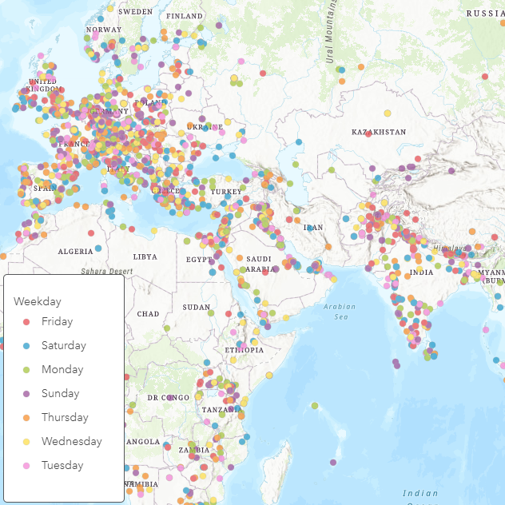

# Weekdays

This expression converts date fields into weekdays (Monday, Tuesday etc).

## Use cases

To categorize your time-based data and displaying it based on weekday.

## Workflow

Copy and paste the expression found in the expression template below to the Arcade editor in ArcGIS Online, the relevant location in ArcGIS Pro, or the relevant location in a custom app.

To configure the script to your layer, edit the first line to specify the field name you would like to use instead of the example `Date`.

```js
var myDatefield = $feature["Date"];
```

## Expression Template
This Arcade expression will convert your date field into weekdays.

```js
var myDatefield = $feature["Date"];
// Handle both real date fields and string fields with date-looking strings
// for both empty dates and invalid values
function DayOfWeek (dateOrString) {
  var theDate = IIf(TypeOf(dateOrString) == "Date", dateOrString, Date(dateOrString));
  return Decode( Weekday( theDate ),
    1, "Monday",
    2, "Tuesday",
    3, "Wednesday",
    4, "Thursday",
    5, "Friday",
    6, "Saturday",
    0, "Sunday",
    "missing data"); // Decode function requires a default
}
DayOfWeek( myDatefield )
```

## Example output

See [this webmap](https://jsapi.maps.arcgis.com/home/webmap/viewer.html?webmap=1cd4e31d7c414cf9bfd1ca2fe9dd1dfd) for examples of how to use this expression for both visualization and popups in ArcGIS Online.


