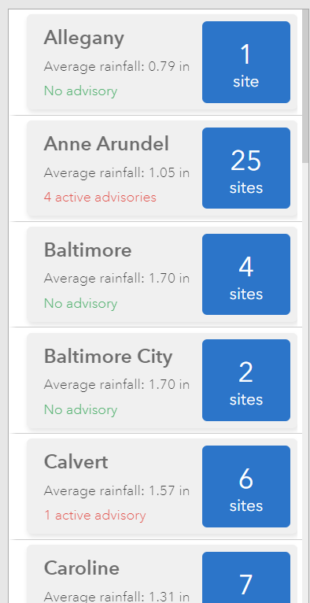

# Calculate multiple statistics using Arcade's GroupBy() function.  

This expression calculates mutliple statistic values using the GroupBy() function. The featureset can be used to enhance the List element which supports feature-based visualization. 

_Note for Enterprise users: Prior to Enterprise 11.2, the FeatureSet() function does not accept dictionaries. You must wrap the dictionary with a Text() function: FeatureSet(Text(dict)). Additionally, dates need to be in EPOCH and can be converted by wrapping them with the Number() function: Number(Now()). For more information see https://community.esri.com/t5/arcgis-dashboards-blog/dashboard-data-expressions-what-has-changed-june/bc-p/1299698_

```js
var portal = Portal('https://www.arcgis.com/');
var fs = FeatureSetByPortalItem(
    portal,
    'ac53e31738bf488d9f3c0534c7635a91',
    0,
    [
        'COUNTY',
        'STATIONNUM',
        'RAINFALL',
        'ADVISORYDESC'
    ],
    false
);

return GroupBy(fs, ['COUNTY'], 
[{name: 'total_sites', expression: 'STATIONNUM', statistic: 'COUNT' }, 
 {name: 'avg_rain', expression: 'RAINFALL', statistic: 'AVG' },
 {name: 'count_adv', expression: 'ADVISORYDESC', statistic: 'COUNT' }]); 
```


