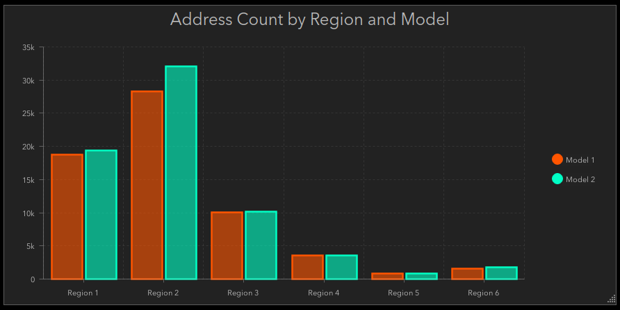

# Join attributes from a layer to a table

This expression reads two layers & adds attributes from one to the other based on a shared ID. Typically this same operation would be completed through a dynamic join using hosted feature layers as described here: 
https://doc.arcgis.com/en/arcgis-online/analyze/join-features.htm

In cases where the dynamic join isn't possible (i.e. you are not the owner of the layers, you're pulling data from Portal into ArcGIS Online, etc) this workflow could be used to add attributes from the source layer to the target.

_Note for Enterprise users: Prior to Enterprise 11.2, the FeatureSet() function does not accept dictionaries. You must wrap the dictionary with a Text() function: FeatureSet(Text(dict)). Additionally, dates need to be in EPOCH and can be converted by wrapping them with the Number() function: Number(Now()). For more information see https://community.esri.com/t5/arcgis-dashboards-blog/dashboard-data-expressions-what-has-changed-june/bc-p/1299698_

## Example Expression

```js
var portal = Portal("https://www.arcgis.com/");
var polyfs = FeatureSetByPortalItem(
    portal,
    "4dbbad3d6f694e0ebc7c3b4132ea34df",
    0,
    ["*"],
    false
);

var tablefs = FeatureSetByPortalItem(
    portal,
    "4dbbad3d6f694e0ebc7c3b4132ea34df",
    6,
    ["*"],
    false
);

// Create empty features array and feat object
var features = [];
var feat;

// Populate Feature Array
for (var t in tablefs) {
    var tableID = t["FeatureID"]
    for (var p in Filter(polyfs, "HydroID = "+tableID)){
        feat = {
            attributes: {
                FeatureID: tableID,
                Name: p["DPS_Region"],
				ModelID: t["ModelID"],
                AddressCount: t["AddressCount"],
                MAX_TSTime: t["MAX_TSTime"],
            }
        }

    Push(features, feat)
    }
}

var joinedDict = {
    fields: [
        { name: "FeatureID", type: "esriFieldTypeString" },
        { name: "Name", type: "esriFieldTypeString" },	
        { name: "ModelID", type: "esriFieldTypeInteger" },
        { name: "AddressCount", type: "esriFieldTypeInteger" },
        { name: "MAX_TSTime", type: "esriFieldTypeString" },
    ],
    'geometryType': '',
    'features':features
};

// Return dictionary cast as a feature set 
return FeatureSet(joinedDict);
```

Bringing additional attributes into our main layer by a shared ID allows us to combine data we would otherwise not be able to, as in the following chart. Note that the `DPS_Region` field comes from the polygon layer, while the `ModelID` and `AddressCount` fields come from the tabular layer.


