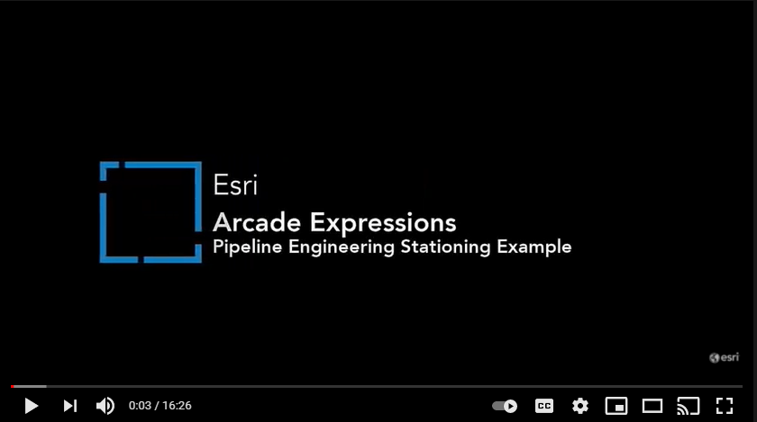
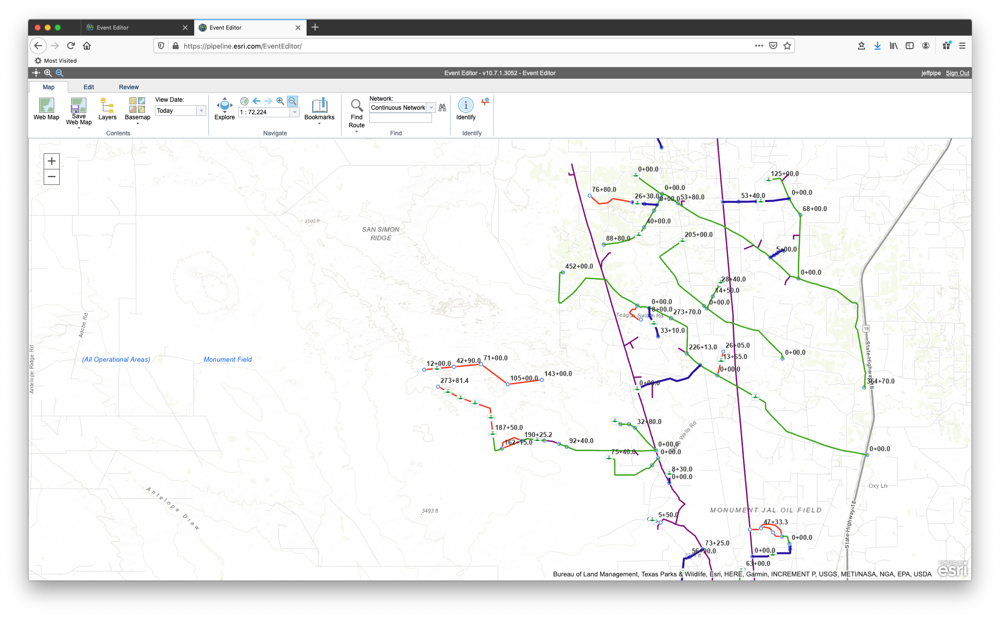
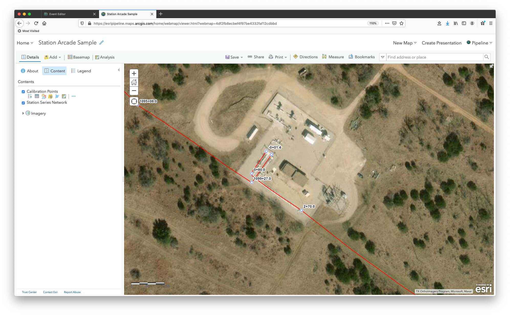

# Station Labels

ArcGIS Arcade is a simple scripting language that can be used across ArcGIS. Arcade Expressions can be used to generate symbology, pop-ups, labels, and more and are supported in ArcGIS Pro, web maps, and mobile applications. Here we will look at using Arcade Expression when working with linear referencing pipeline asset data.

## Use cases

Labeling stations and vertices with measure values along pipelines.

## Workflow

Copy and paste the expression found in the expression template below to the Arcade editor in ArcGIS Online, the relevant location in ArcGIS Pro, or the relevant location in a custom app.

### Watch this YouTube video for a detailed workflow example

[](https://www.youtube.com/watch?v=VYjkEofjsxI 'Using ArcGIS Arcade expressions with linear referencing data')

## Expression Template

This arcade expression will return a formatted string for use in labeling stationing along a pipeline. Stationing specifies the relative point along any reference line.

```js
// Stationing specifies the relative point along any reference line
//US Survey Foot - 1 station = 100.0' = 1+00.0
//Metric - 1 station = 1000.0m = 1+000.0

var station = $feature.MEASURE

var IsNegative = 0 //tracks +/- values
var Type = 'Feet' //"Meters" Switch type as needed

if (station < 0) {
  //convert all negative stations to positive and append back the - at the end
  station = station * -1
  IsNegative = 1
}

//##00+00.0 or ##0+000.0 - These functions will provide this format regardless the length of the field
//formatting with decimals after the + sign - if there is not

if (Type == 'Feet') var StationlbR = Text(station, '00.0')
if (Type == 'Meters') var StationlbR = Text(station, '000.0')

//Getting rid of the two initial character dividing by 100 or 1000. formatting result with 2 zeros and room for more characters
//using the Split function to extract from the second character from the left of the decimal point
if (Type == 'Feet')
  var StationlbL = Text(First(Split(station / 100, '.', 1)), '###00')
if (Type == 'Meters')
  var StationlbL = Text(First(Split(station / 1000, '.', 1)), '###000')

var Stationlb = Concatenate([StationlbL, StationlbR], '+')
if (IsNegative == 1) Stationlb = '-' + Stationlb

return Stationlb
```

## Example output

### Event Editor



### Web Map



### Mobile


