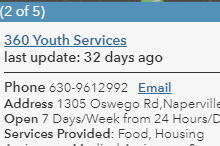

# Add a date since last update field to a pop-up

[]

This example shows how to add days since the last update for the AGO map viewer popup configuration panel 

## Use cases

This is designed specifically for the AGO map viewer popup. These set of expressions allow you to represent the number of days since a point or polygon has been udpated.

## Workflow

Copy and paste the expression found in the expression template below to the Arcade editor in ArcGIS Online, the relevant location in ArcGIS Pro, or the relevant location in a custom app.

## Expression Template

Create an expression to identify the date field and find the 

```js
//get the time currently
var timeNow = Date();
//get the time field form your feature layer
var survey = $feature["YOUR_DATE_FIELD_NAME_HERE"];
//get time in hrs, days and use datediff to get the differnce betwen the time now and the time when the layer was updated
var datehrs = Round(DateDiff(survey, timeNow, 'hours'),1);
var datedays = Round(DateDiff(survey, timeNow, 'days'),0);
//display hrs, day or days depending on how long since last updated.
When(
 datehrs < 24, concatenate(datehrs, ' hrs ago'),
 datedays < 2, concatenate(datedays, ' day ago'),
 datehrs >= 48, concatenate(datedays, ' days ago'),
 'error' );
```

## HTML Template

Now add this expression into yoour custom attribute display with the name of your attribute expression. I added the expression to the pop-up title instead so it is displayed more prominently in widgets such as near-me.

```html
last update: {expression/expr["YOUR EXPRESSION NUMBER HERE"]}
```

## Example output

[]
