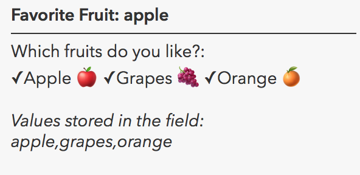

# Display labels for Survey123 multiple choice questions

Substitutes author-defined values for the value stored by a Survey123 multiple choice question.  This also can work for single-choice questions that do not have a domain defined in the feature layer.

## Use cases
This is designed to work with multiple choice questions in Survey123, which are stored as a comma-separated list in the field of the form's feature layer.  As part of setting up the function, the web author will need to provide the choices from the Survey123 form and change, if desired the formatting string of the label.

## Workflow
Copy and paste the expression found in the expression template below to 
the Arcade editor in ArcGIS Online, the relevant location in ArcGIS Pro, or
the relevant location in a custom app.

To configure the script to your layer, you must replace the choices in the template with the `name` and `label` values from the Survey123 form.  For the template below, the multiple choice question had a choice list of:

|list_name|name       |label         |
|---------|-----------|--------------|
|fruits	  |apple      |Apple 🍎      |
|fruits   |banana     |Banana 🍌     |
|fruits   |grapes     |Grapes 🍇     |
|fruits   |kiwi       |Kiwi 🥝       |
|fruits   |orange     |Orange 🍊     |
|fruits   |peach      |Peach 🍑      |
|fruits   |strawberry |Strawberry 🍓 |

Optionally, you can reconfigure `formatLabels`'s `Concatenate` function if you want to have different text before or after the label.

## Expression Template

```js
// Replace the field name here
var fieldName = "like_fruits";

// Replace the choices here
var choices = {};
choices['apple'] = 'Apple 🍎';
choices['banana'] = 'Banana 🍌';
choices['grapes'] = 'Grapes 🍇';
choices['kiwi'] = 'Kiwi 🥝';
choices['orange'] = 'Orange 🍊';
choices['peach'] = 'Peach 🍑';
choices['strawberry'] = 'Strawberry 🍓';

function formatLabels(inText) {
    return Concatenate("✓", inText);
}

function formatMulti(inField, d) {
    var values = Split(inField, ',')
    var labels = []
    for (var i in values){
        labels[i] = formatLabels(d[values[i]])
    }
    var outText = Concatenate(labels, TextFormatting.NewLine);
    return outText;
}

formatMulti($feature[fieldName], choices);
```

## Example output
See [this webmap](http://www.arcgis.com/home/webmap/viewer.html?webmap=f7d8c24c84e34f97a553ed31336e00ca) for an example of how to use this expression in ArcGIS Online.

