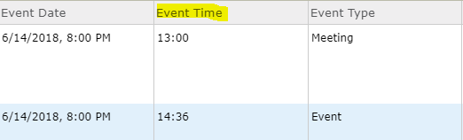

# Convert military time to civilian time

Converts a text value representing military time to civilian time.

## Use cases

For datasets that contain a string field representing time in military format, this expression converts that time to civilian time. Not all considerations are taken into account such as timezone conversion. All times are expected to be in the same timezone.

## Workflow

Copy and paste the expression found in the expression template below to
the Arcade editor in ArcGIS Online, the relevant location in ArcGIS Pro, or
the relevant location in a custom app.

To configure the script to your layer, you must provide a field name of a string
field containing time values in military time (e.g. `13:00`, `22:36`, `00:45`).

## Expression Template

```js
// Replace TIME_FIELD_NAME_HERE with the name of the
// time field in military time. This value should be a string.
// e.g. `13:00`, `22:36`, `00:45`

var eventTime = $feature.TIME_FIELD_NAME_HERE;

var militaryHours = Number(Split(eventTime, ":", 2)[0]);
var minutes = Split(eventTime, ":", 2)[1];
var civilianHours = When( 
  militaryHours > 12, militaryHours - 12,
  militaryHours == 0, 12,
militaryHours );
var suffix = When(
  militaryHours == 24, " a.m.",
  militaryHours >= 12, " p.m.",
" a.m." );
Concatenate( [ civilianHours, minutes ], ":" ) + suffix;
```

## Example time field



Output will look like the following for the two highlighted features:

`1:00 p.m.`
`2:36 p.m.`
