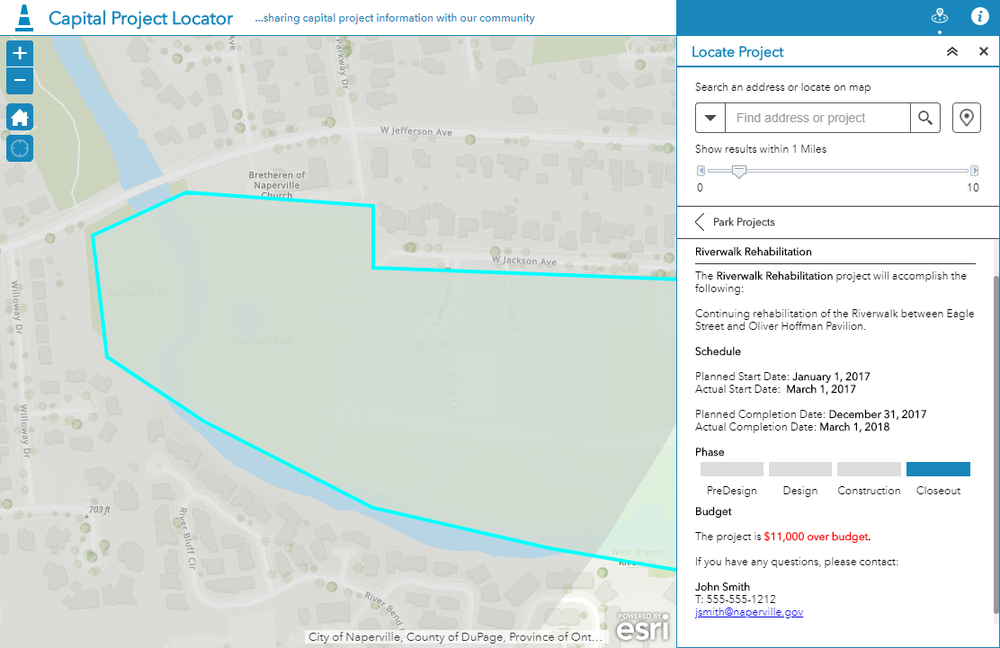

# Style the difference between 2 numeric fields

This example shows how to show the difference between 2 fields and style the value depending on if it is positive or negative.

## Use cases

This is designed specifically for the popup profile. In the example below we are highlighting if a project is over or under budget by displaying if a project's actual cost is over or under the original estimated cost. This same logic could be applied to any scenario where you need to dynamically show the difference between two numeric fields and style them differently depending on if the value is positive or negative.

## Workflow

Copy and paste the expression found in the expression template below to the Arcade editor in ArcGIS Online, the relevant location in ArcGIS Pro, or the relevant location in a custom app.

To configure the script to your layer, you must replace the FIELD1 and FIELD2 variables with the fields containing the numeric values in your layer. You can also update the format string in the Text function to control how the resulting value is formatted. 

## Expression Template

For example, in a layer with a field called ACTCOST representing the actual cost of a project and a field called ESTCOST represing the original estimated cost, you would replace this:

```js
// Update the text formatting as needed.
IIF($feature.FIELD1 <= $feature.FIELD2, Text($feature.FIELD1 - $feature.FIELD2), '#,###.##'), null)
```

With something like the following:

```js
IIF($feature.ACTCOST <= $feature.ESTCOST, Text(Abs($feature.ACTCOST - $feature.ESTCOST), '$#,###')  + ' under budget', null)
```

The expression above will return a value if the first field is less than or equal to the second field otherwise it will return null. In this scenario this represents a project that is under budget. We need to add another attribute expression for when the first field is greater than the second field or over budget. To do this, you would replace this:

```js
// Update the text formatting as needed.
IIF($feature.FIELD1 > $feature.FIELD2, Text($feature.FIELD1 - $feature.FIELD2), '#,###.##'), null)
```

With something like the following:

```js
IIF($feature.ACTCOST > $feature.ESTCOST, Text(Abs($feature.ACTCOST - $feature.ESTCOST), '$#,###') + ' over budget', null)
```

## HTML Template

Next you will need to configure the pop-up with a custom attribute display. Click the View HTML source button and add the following HTML. You will want to update the expression references to correspond to the 2 expressions you created above. In this scenario we are styling under budget with a green font color and over budget with a red font color. You can customize this to fit your scenario. When an expression returns a null value it will not display this means that only one of the expressions below will display for any given feature.

```html
The project is <font color="#228b22">{expression/expr0}</font><font color="#ff0000">{expression/expr1}</font>

```

## Example output

See the [Capital Project Locator](http://links.esri.com/localgovernment/tryit/CapitalProjectLocator) application for an example of how this expression is used in ArcGIS Online.

[](http://links.esri.com/localgovernment/tryit/CapitalProjectLocator)
