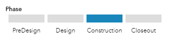

# Add a project phase/status graphic

This example shows how to add a custom project phase or status graphic to a pop-up



## Use cases

This is designed specifically for the popup profile. These set of expressions allow you to represent the current phase of a project or status of an incident as a progress bar. In the scenario below we have a layer with a field called PROJPHASE with a domain for the 4 phases of a project: PreDesign, Design, Construction, Closeout. Each feature will have one of these values set for the project phase and we would like to highlight the status of the project in the pop-up.

## Workflow

Copy and paste the expression found in the expression template below to the Arcade editor in ArcGIS Online, the relevant location in ArcGIS Pro, or the relevant location in a custom app.

To configure the script to your layer, you must replace the field variable to the name of the field containing the phases, set 'PHASE1' to the value of the corresponding phase value, and update the background-color to the HEX value of the color the phase. 

## Expression Template

For example, in a layer with a field called PROJPHASE with a domain for the 4 phases of the project (PreDesign, Design, Construction, and Closeout), you would replace this:

```js
if ($feature.FIELD == 'PHASE1') {
  return 'background-color:#000000';
}
return 'background-color:#DDDDDD';
```

With something like the following:

```js
if ($feature.PROJPHASE == 'PreDesign') {
  return 'background-color:#1987bb';
}
return 'background-color:#DDDDDD';
```

You will need to do this for each phase in the project. In the example above you would need 4 arcade expressions (PreDesign, Design, Construction, and Closeout).


## HTML Template

Next you will need to configure the pop-up with a custom attribute display. Click the View HTML source button and add the following HTML table. You will want to update the expression references to correspond to the 4 expressions you created above. You will also need to update the project phase names to correspond to the different stages in your project phase field. You can add additional cells to each of the rows if you support more phases, for example you would replace this:

```html
<span><b>Phase</b></span>
<table style=" border-collapse: separate; border-spacing: 6px 4px; width: 100%; table-layout: fixed;">
  <tbody><tr height="16">
    <td style="{expression/expr0}"></td>
    <td style="{expression/expr1}"></td>
    <td style="{expression/expr2}"></td>
  </tr>
  <tr height="24" style="text-align: center;">
    <td>PHASE1</td>
    <td>PHASE2</td>
    <td>PHASE3</td>
  </tr>
</tbody></table>
```

With something like the following:

```html
<span><b>Phase</b></span>
<table style=" border-collapse: separate; border-spacing: 6px 4px; width: 100%; table-layout: fixed;">
  <tbody><tr height="16">
    <td style="{expression/expr0}"></td>
    <td style="{expression/expr1}"></td>
    <td style="{expression/expr2}"></td>
    <td style="{expression/expr3}"></td>
  </tr>
  <tr height="24" style="text-align: center;">
    <td>PreDesign</td>
    <td>Design</td>
    <td>Construction</td>
    <td>Closeout</td>
  </tr>
</tbody></table>
```

## Example output

See the [Capital Project Locator](http://links.esri.com/localgovernment/tryit/CapitalProjectLocator) application for an example of how this expression is used in ArcGIS Online.

[](http://links.esri.com/localgovernment/tryit/CapitalProjectLocator)
