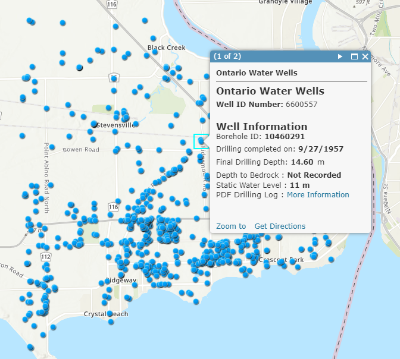

# Dynamically create a hyperlink in a popup

This example shows how to create a custom hyperlink based of field values from a feature 

## Use cases

This is designed specifically for the popup profile. Many datasets have corresponding data that lives outside their GIS accessible via the web (pdf reports, images etc.).  Those urls are often structured and can be built dynamically from existing fields.  By using arcade to construct the url, it means that as the data changes the link stays up to date. 

## Workflow

Copy and paste the expression found in the expression template below to 
the Arcade editor in ArcGIS Online, the relevant location in ArcGIS Pro, or
the relevant location in a custom app.

To configure the script to your layer, you must replace the field variables
with your own, and adjust the url format to match your website. In the example
below a field is used to construct part of the url path as well as the filename
for a pdf.  Following this pattern, you can build more complicated urls by more 
fields as required.


```js
"Your Base URL" + 
Left($feature.field_name_1, 3) + "/" + $feature.field_name_1 + ".pdf"
```

With something like the following:

```js
"https://www.ontario.ca/sites/default/files/moe_mapping/downloads/2Water/Wells_pdfs/" + 
Left($feature.WELL_ID, 3) + "/" + $feature.WELL_ID + ".pdf"
```

## Expression Template

```js
"Your Base URL" + 
Left($feature.field_name_1, 3) + "/" + $feature.field_name_1 + ".pdf"
```

## Example output

See [this webmap](https://arcg.is/1K9jbu) for examples of how to use this expression in ArcGIS Online.  Note not all wells have a pdf log.

[](https://arcg.is/1K9jbu)
