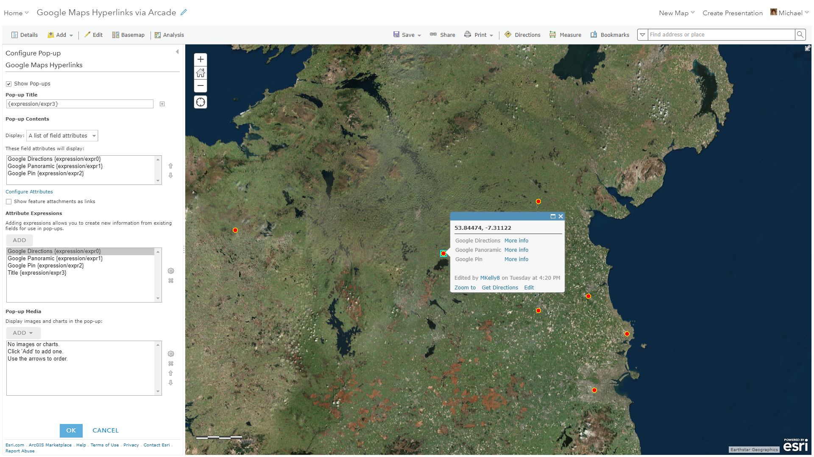

# Dynamically create a hyperlink with lat long values in a popup

This example shows how to create a custom hyperlink based on a hard coded base url in combination with lat and long values calculated using Arcade

## Use cases

* Open Google Maps and drop a pin at the same location
* Open Google Maps and get directions from your Current Location to the specified location
* Open Google Maps and open a panoramic view at the same location

This code gets latitude and longitude values for points, lines and polygons using Arcade functions. For lines and polygons, centroid values are generated. As Arcade passes back geometries in the spatial reference of the Web Map basemap, it is likely that a conversion is necessary as most basemaps in ArcGIS Online are in Web Mercator Auxiliary Sphere. The conversion from Web Mercator Auxiliary Sphere to WGS84  is included in the code.

## Workflow

Copy and paste the expression found in the expression template below to the Arcade editor in ArcGIS Online, the relevant location in ArcGIS Pro, or the relevant location in a custom app.

To configure the script to your layer, you replace the EndGoal variable with one of Google Directions, Google Panoramic or Google Pin. If you want to pass these geometry values to other API's, simply alter the code to add a new BaseUrl and pass the appropriate parameters.

## Expression Template

```js
//Options are Google Directions, Google Panoramic and Google Pin
var EndGoal = "Google Directions"

var BaseUrl = Decode(EndGoal,
  "Google Directions", "https://www.google.com/maps/dir/?api=1&origin=Current+Location&destination=",
  "Google Panoramic", "https://www.google.com/maps/@?api=1&map_action=pano&viewpoint=",
  "Google Pin", "https://www.google.com/maps/@?api=1&map_action=pano&viewpoint=",
  "Invalid"
);

if (BaseUrl == "Invalid"){
  Console(EndGoal + " is an invalid value for EndGoal.");
}

var ArcadeX = Geometry($feature).x;
var ArcadeY = Geometry($feature).y;
var ArcadeSr = Geometry($feature).spatialReference.wkid;
var Latitude, Longitude;

function AuxSphereToLatLon(x, y) {

    Console("Converting...");
    //Conversion based on http://dotnetfollower.com/wordpress/2011/07/javascript-how-to-convert-mercator-sphere-coordinates-to-latitude-and-longitude/
    var rMajor = 6378137;
    var shift = PI * rMajor;
    Longitude = x / shift * 180.0;
    Latitude = y / shift * 180.0;
    Latitude = 180 / PI * (2 * Atan(Exp(Latitude * PI / 180.0)) - PI / 2.0);
}

if (ArcadeSr == 4326) {
    Console("4326 Spatial Reference - No Conversion Necessary");
	Latitude = ArcadeY;
	Longitude = ArcadeX;
} else if (ArcadeSr == 102100) {
    Console("102100 Spatial Reference - Conversion Necessary");
    AuxSphereToLatLon(ArcadeX, ArcadeY);
}

//Build Url Link
function BuildLink(Url, Lat, Long) {
	return Url + text(Lat) + "," + text(Long);
}

BuildLink(BaseUrl, Latitude, Longitude);
```

## Example output

See [this web map](https://bit.ly/url-withlocation) for examples of how to use this expression in ArcGIS Online.  

[](https://bit.ly/url-withlocation)
