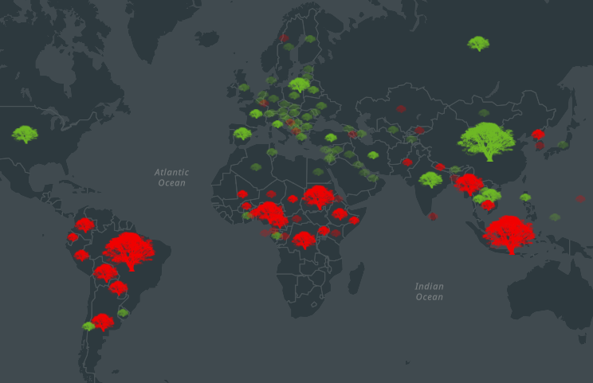

# Cast text to a number

This expression returns the change over time (increase or decrease) by symbols/categories and the 
actual value of increase or decrease by symbol size. For example, if a layer contains two numeric fields 
representing the same variable, but at different times (e.g., POPULATION_2017 and POPULATION_2010) the map will show whether each location experienced an increase or 
decrease in value from one time period to the next. The size of the symbol will show how much it increased
or decreased over time. 

## Use cases

Calculating change over time is useful when you have two numeric fields comparing values at two different times, and you would like to 
indicate the change between the fields. This is common in the visualization profile, 
but it may be used in the popup profiles as well. For example, this could be used to visualize change in population over time or change in forest area.

## Workflow

Copy and paste the expression found in the expression template below to 
the Arcade editor in ArcGIS Online, the relevant location in ArcGIS Pro, or
the relevant location in a custom app.

To configure the script to your layer, you must fill in the two field names that represent each year. Modify the alias
with language that represents change (e.g., gain vs. loss, increase vs. decrease, growth vs. decline, etc.)

For example, in a layer containing fields for forest area in 2015 and 1990, you would replace this:

```js
var change = $feature.FIELD_NAME_YEAR1-$feature.FIELD_NAME_YEAR2;

When (change > 0, "DESCRIBE INCREASE", change < 0, "DESCRIBE DECREASE", null);
```

With something like the following:

```js
var change = $feature.F2015-$feature.F1990;

When (change > 0, "Gain", change < 0, "Loss", null);
```

## Expression Template
The first attribute classifies each geometry as either an increase or decrease. This is symbolized by color and/or symbols. 

```js
//Create variable change that calculates the difference between the most recent year (year 1) and year 2.
var change = $feature.FIELD_NAME_YEAR1-$feature.FIELD_NAME_YEAR2

//When the change or difference is greater than zero, this will be categorized as an increase, 
//but when the change is less than zero, it will be categorized as a decrease. Optionally, you can change null to "No Change". 
When (change > 0, "DESCRIBE INCREASE", change < 0, "DESCRIBE DECREASE", null)
```

The second attribute visualizes the numeric change over time by size of the symbol. 
```js
//Use the absolute value function to calculate the difference between the most recent year (year 1) and year 2.
Abs($feature.FIELD_NAME_YEAR1-$feature.FIELD_NAME_YEAR2)

```

## Example output

See [this web map](https://urbanobservatory.maps.arcgis.com/home/webmap/viewer.html?webmap=c81328482ced43a4ab455c0d7563d0f4) for examples of how to use this expression in ArcGIS Online. Red trees represent a loss in forest area while green trees represent a growth. The larger the symbol the greater the loss or growth.

[](https://urbanobservatory.maps.arcgis.com/home/webmap/viewer.html?webmap=c81328482ced43a4ab455c0d7563d0f4)
